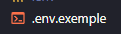
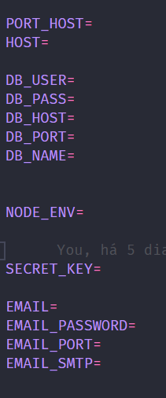
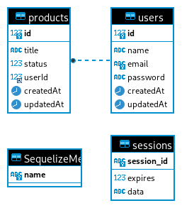
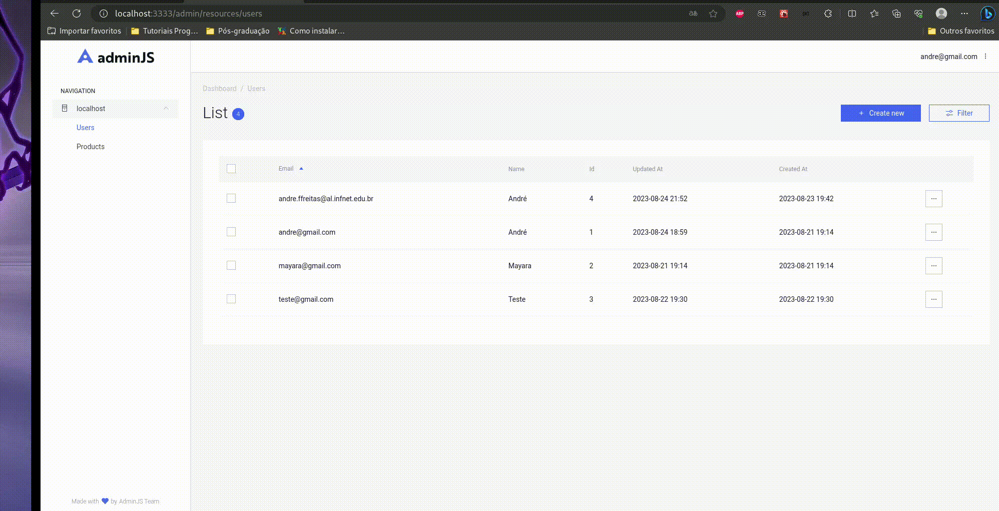
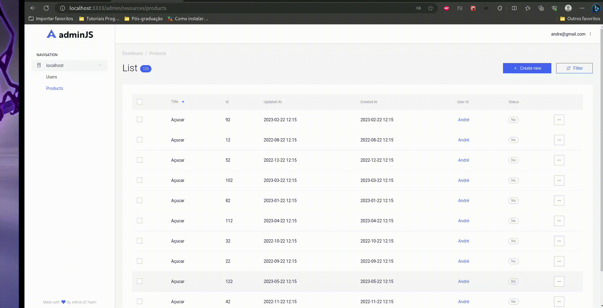
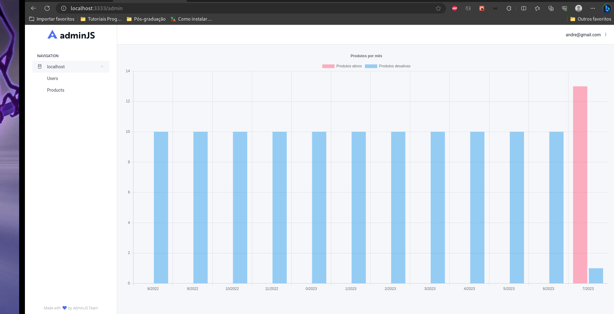

## <h1>Shopping list documentation</h1>

<h3>Initial setting</h3>

<h5>1. Env</h5>

It is necessary to make a copy of the .env.example file, rename the file to .env and fill it with your data.

<h6>File</h6>

<h6>Fields to be filled</h6>

<h5>2. Commands</h5>

<ol>
  <li>yarn install</li>
  <li>yarn sequelize db:migrate</li>
  <li>yarn sequelize db:seed:all</li>
  <li>yarn dev</li>
</ol>

<h4>Access data</h4>

email: example@example.com

password: 123456

<h5>3. Entity-relationship model</h5>

<h5>4. Project images</h5>

<h6>Users</h6>

<h6>Products</h6>

<h6>Graph</h6>

